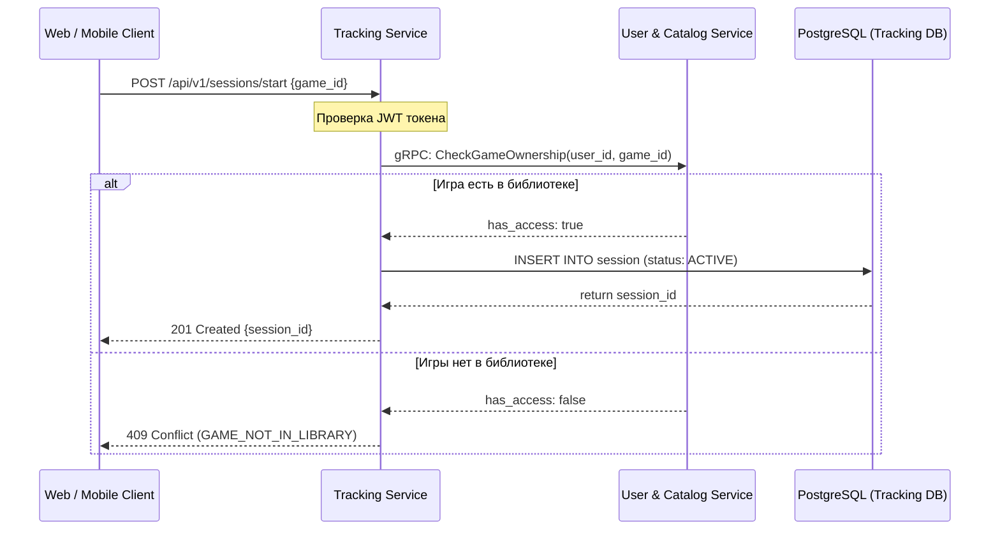

# Проектирование API и контрактов

## 1. Общие соглашения и обработка ошибок
Все ответы API (и успешные, и ошибки) возвращаются в формате `application/json`.
Используются стандартные HTTP-коды:
* `200 OK` — успешный запрос (получение данных).
* `201 Created` — ресурс успешно создан (регистрация, старт сессии).
* `400 Bad Request` — ошибка валидации данных (неверный JSON).
* `401 Unauthorized` — нет JWT-токена или он просрочен.
* `403 Forbidden` — попытка доступа к чужим данным (например, стоп чужой сессии).
* `404 Not Found` — ресурс не найден (игра или пользователь не существует).
* `409 Conflict` — бизнес-логика нарушена (попытка добавить игру, которая уже есть в библиотеке).
* `500 Internal Server Error` — ошибка на сервере.

## 2. API сервиса: User & Catalog Service
Отвечает за юзеров и библиотеку.

**POST /api/v1/users/register**
* Суть: Регистрация нового пользователя.

**POST /api/v1/users/login**
* Суть: Авторизация, возвращает JWT-токен.

**GET /api/v1/games**
* Суть: Получить список всех игр (каталог) с пагинацией.

**GET /api/v1/users/me/library**
* Суть: Получить список игр в библиотеке текущего пользователя.

**POST /api/v1/users/me/library/{game_id}**
* Суть: Добавить игру в свою библиотеку.


## 3. API сервиса: Tracking ServiceОтвечает за сессии и лидерборды.

**POST /api/v1/sessions/start*** Суть: Начать игровую сессию. В теле передается `game_id`.

**POST /api/v1/sessions/{session_id}/stop*** Суть: Завершить текущую сессию.

**POST /api/v1/sessions/{session_id}/score*** Суть: Начислить очки за достижение в активной сессии.

**GET /api/v1/leaderboard/{game_id}*** Суть: Получить топ игроков по конкретной игре.

## 4. Межсервисное взаимодействие (gRPC)
Когда юзер пытается стартовать сессию в Tracking Service, нам нужно проверить, есть ли эта игра у него в библиотеке (которая лежит в User & Catalog Service). 

Для этого описываем gRPC контракт (Protobuf):

```proto
syntax = "proto3";
package library;

service LibraryAccessService {
  rpc CheckGameOwnership (OwnershipRequest) returns (OwnershipResponse);
}

message OwnershipRequest {
  string user_id = 1;
  string game_id = 2;
}

message OwnershipResponse {
  bool has_access = 1;
}
```
*Tracking Service выступает как gRPC-клиент, а User & Catalog Service — как gRPC-сервер.*

## 5. Схемы данных (DTO) / Контракты

Пример JSON-тела для старта сессии (`POST /api/v1/sessions/start`):
```json
{
  "game_id": "550e8400-e29b-41d4-a716-446655440000"
}
```
Пример ответа при успешном старте (`201 Created`):
```json
{
  "session_id": "a1b2c3d4-e5f6-7890-abcd-1234567890ab",
  "status": "ACTIVE",
  "started_at": "2026-05-20T18:30:00Z"
}
```
Пример ответа с ошибкой бизнес-логики (`409 Conflict`):
```json
{
  "error_code": "GAME_NOT_IN_LIBRARY",
  "message": "You cannot start a session for a game you do not own."
}
```

## 6. Sequence Diagram (Сценарий: Старт сессии)
Здесь показано синхронное взаимодействие между клиентом, двумя микросервисами (по gRPC) и базой данных.


