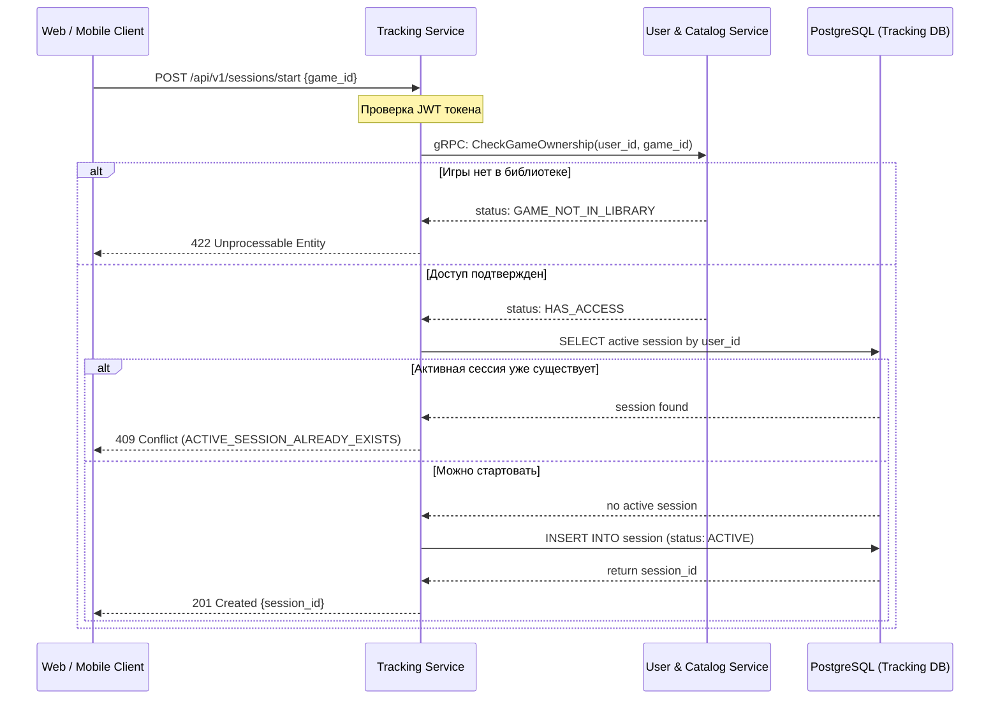

# Проектирование API и контрактов

## 1. Общие соглашения и обработка ошибок
Все ответы API возвращаются в формате `application/json`.
В системе используются следующие HTTP-коды:
* `200 OK` — успешный запрос.
* `201 Created` — ресурс успешно создан (регистрация, старт сессии).
* `400 Bad Request` — неверный формат запроса (ошибка валидации JSON).
* `401 Unauthorized` — отсутствует или недействителен JWT-токен.
* `403 Forbidden` — нет прав на выполнение действия.
* `404 Not Found` — ресурс (пользователь, игра, сессия) не найден.
* `409 Conflict` — конфликт текущего состояния (например, ACTIVE_SESSION_ALREADY_EXISTS, GAME_ALREADY_IN_LIBRARY).
* `422 Unprocessable Entity` — нарушение бизнес-логики (например, GAME_NOT_IN_LIBRARY).
* `500 Internal Server Error` — внутренняя ошибка сервера.

**Единый формат ошибки**
Все ошибки возвращаются в стандартизированном JSON-формате:
```json
{
  "error_code": "GAME_NOT_IN_LIBRARY",
  "message": "User cannot start a session for a game that is not in the library.",
  "details": {
    "game_id": "550e8400-e29b-41d4-a716-446655440000"
  }
}
```
Поле `error_code` используется клиентом для программной обработки ошибки, `message` — для отображения или логирования, `details` содержит дополнительные данные об ошибке.

## 2. Public REST API: User & Catalog Service
Отвечает за профили пользователей, каталог игр и управление библиотекой.

| Метод | Endpoint | Auth | Описание |
| :--- | :--- | :--- | :--- |
| POST | `/api/v1/users/register` | Нет | Регистрация нового пользователя |
| POST | `/api/v1/users/login` | Нет | Авторизация, получение JWT |
| GET | `/api/v1/users/me` | Да | Получить профиль текущего пользователя |
| GET | `/api/v1/games` | Нет | Получить общий каталог игр |
| GET | `/api/v1/games/{game_id}` | Нет | Получить данные конкретной игры |
| GET | `/api/v1/users/me/library` | Да | Получить библиотеку пользователя |
| POST | `/api/v1/users/me/library/{game_id}` | Да | Добавить игру в библиотеку |
| DELETE | `/api/v1/users/me/library/{game_id}` | Да | Удалить игру из библиотеки (история сессий сохраняется) |

## 3. Public REST API: Tracking Service
Отвечает за управление сессиями и вывод статистики.

*Примечание по архитектуре: Несмотря на путь `/api/v1/games/{game_id}/leaderboard`, этот endpoint обслуживается сервисом Tracking Service, так как лидерборд строится по агрегированным данным Score. Game ID используется здесь исключительно как идентификатор доменного объекта из каталога.*

| Метод | Endpoint | Auth | Описание |
| :--- | :--- | :--- | :--- |
| POST | `/api/v1/sessions/start` | Да | Начать новую игровую сессию |
| POST | `/api/v1/sessions/{session_id}/stop` | Да | Завершить активную сессию |
| GET | `/api/v1/sessions/active` | Да | Получить текущую активную сессию пользователя |
| GET | `/api/v1/sessions/history` | Да | Получить историю сессий пользователя |
| GET | `/api/v1/games/{game_id}/leaderboard?limit=100&offset=0` | Да | Получить лидерборд по игре (с пагинацией) |

## 4. Internal API
Внутренние эндпоинты, закрытые от внешних клиентов на уровне API Gateway или требующие сервисного токена.

**Internal REST API (Начисление очков)**
* Метод: `POST /api/v1/internal/sessions/{session_id}/score`
* Auth: Service Token
* Описание: Вызывается только игровым сервером для фиксации достижений пользователя. Внешний клиент не имеет доступа к этому методу.

**Internal gRPC API (Проверка доступа)**
Используется сервисом Tracking Service для синхронной проверки наличия игры в библиотеке пользователя (обращение к User & Catalog Service).

```proto
syntax = "proto3";
package library;

service LibraryAccessService {
  rpc CheckGameOwnership (OwnershipRequest) returns (OwnershipResponse);
}

message OwnershipRequest {
  string user_id = 1;
  string game_id = 2;
}

enum OwnershipStatus {
  OWNERSHIP_STATUS_UNSPECIFIED = 0;
  HAS_ACCESS = 1;
  USER_NOT_FOUND = 2;
  GAME_NOT_FOUND = 3;
  GAME_NOT_IN_LIBRARY = 4;
}

message OwnershipResponse {
  OwnershipStatus status = 1;
}
```

## 5. Детализация контрактов (DTO)

**Пример 1: Старт сессии (`POST /api/v1/sessions/start`)**
Request Body:
```json
{
  "game_id": "550e8400-e29b-41d4-a716-446655440000"
}
```
Response `201 Created`:
```json
{
  "session_id": "a1b2c3d4-e5f6-7890-abcd-1234567890ab",
  "game_id": "550e8400-e29b-41d4-a716-446655440000",
  "status": "ACTIVE",
  "started_at": "2026-05-20T18:30:00Z"
}
```

**Пример 2: Завершение сессии (`POST /api/v1/sessions/{session_id}/stop`)**
Response `200 OK`:
```json
{
  "session_id": "a1b2c3d4-e5f6-7890-abcd-1234567890ab",
  "status": "COMPLETED",
  "started_at": "2026-05-20T18:30:00Z",
  "ended_at": "2026-05-20T19:15:00Z",
  "duration_seconds": 2700
}
```

**Пример 3: Получение активной сессии (`GET /api/v1/sessions/active`)**
Response `200 OK` (если сессия есть):
```json
{
  "session_id": "a1b2c3d4-e5f6-7890-abcd-1234567890ab",
  "game_id": "550e8400-e29b-41d4-a716-446655440000",
  "status": "ACTIVE",
  "started_at": "2026-05-20T18:30:00Z"
}
```
Response `404 Not Found` (если активной сессии нет):
```json
{
  "error_code": "ACTIVE_SESSION_NOT_FOUND",
  "message": "User has no active session.",
  "details": {}
}
```

**Пример 4: Начисление очков (Internal API) (`POST /api/v1/internal/sessions/{session_id}/score`)**
Request Body:
```json
{
  "points": 100,
  "reason": "ACHIEVEMENT_UNLOCKED"
}
```
Response `201 Created`:
```json
{
  "score_id": "b2c3d4e5-f6a7-8901-bcde-234567890abc",
  "session_id": "a1b2c3d4-e5f6-7890-abcd-1234567890ab",
  "points": 100,
  "earned_at": "2026-05-20T18:45:00Z"
}
```

**Пример 5: Лидерборд (`GET /api/v1/games/{game_id}/leaderboard?limit=100&offset=0`)**
Response `200 OK`:
```json
{
  "game_id": "550e8400-e29b-41d4-a716-446655440000",
  "limit": 100,
  "offset": 0,
  "items": [
    {
      "user_id": "111e8400-e29b-41d4-a716-446655440000",
      "username": "player_one",
      "total_points": 1500,
      "rank": 1
    }
  ]
}
```

## 6. Sequence Diagram (Сценарий: Старт сессии)
Сценарий включает проверку JWT, межсервисный gRPC-запрос и валидацию бизнес-правила (отсутствие другой активной сессии).


