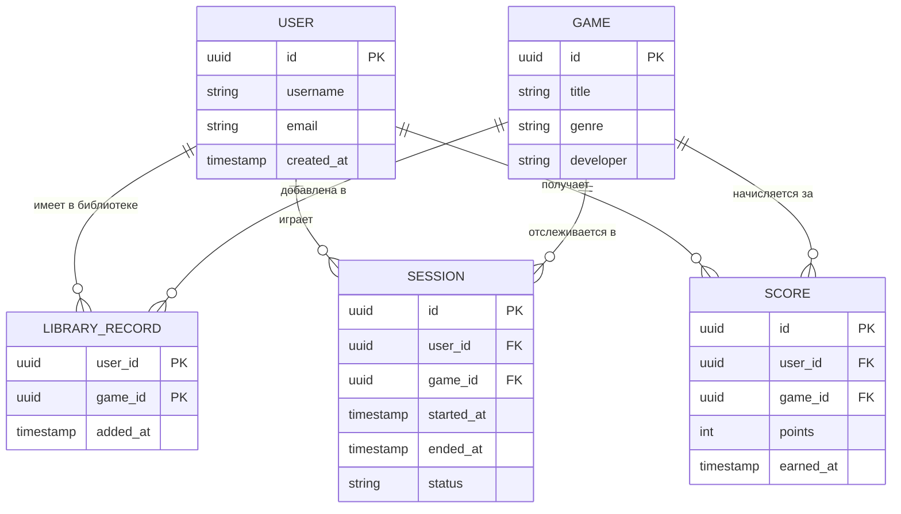

# Проектирование доменной области: Игровая платформа

## 1. Бизнес-контекст
Мы строим игровую платформу-трекер, что-то типа облегченного аналога Steam. Это система, где пользователи могут смотреть каталог игр, добавлять их в свою библиотеку, а платформа будет трекать их игровые сессии, наигранные часы и заработанные очки. На основе этого будут строиться глобальные рейтинги игроков.

## 2. Основные сценарии (Use cases)

**Добавить игру в библиотеку**
* Актор: Пользователь
* Предусловие: Авторизован в системе
* Основной поток: Выбирает игру в каталоге и нажимает "Добавить"
* Результат: Создается запись LibraryRecord, игра появляется в профиле

**Начать сессию**
* Актор: Пользователь
* Предусловие: Авторизован, и игра есть в его библиотеке
* Основной поток: Жмет "Играть", отправляется запрос на старт сессии
* Результат: Создается Session со статусом ACTIVE и фиксируется время старта

**Завершить сессию**
* Актор: Пользователь
* Предусловие: У юзера есть активная сессия
* Основной поток: Закрывает игру, отправляется запрос на стоп
* Результат: У Session проставляется время конца и статус меняется на COMPLETED

**Получить очки**
* Актор: Система / Пользователь
* Предусловие: Идет активная сессия
* Основной поток: Игра присылает событие о получении достижения
* Результат: В базу падает запись Score, общее количество очков юзера увеличивается

**Посмотреть лидерборд**
* Актор: Пользователь
* Предусловие: Авторизован
* Основной поток: Запрашивает топ игроков по конкретной игре
* Результат: Система агрегирует очки и выдает отсортированный список игроков

## 3. Основные сущности
* User (Пользователь): ID, никнейм, email, дата регистрации.
* Game (Игра): ID, название, описание, жанр, разработчик.
* LibraryRecord (Запись библиотеки): связка юзера и игры (составной первичный ключ из ID пользователя и ID игры), дата добавления.
* Session (Игровая сессия): ID сессии, ID юзера, ID игры, время начала и конца, статус (enum: ACTIVE, COMPLETED, CANCELLED).
* Score (Очки): лог события начисления очков, а не итоговый баланс (ID юзера, ID игры, количество очков, дата получения). Итоговые очки считаются агрегацией (суммой) всех Score по user_id и game_id.

## 4. Связи
* User ↔ Game: связь M:N (многие ко многим). Под капотом реализуется через промежуточную таблицу LibraryRecord.
* User → Session: связь 1:M (один юзер может сгенерировать много сессий).
* Game → Session: связь 1:M (по одной игре может быть сыграно много сессий разными юзерами).
* User/Game → Score: связь 1:M (у юзера и игры может быть много логов начисления очков).

## 5. Бизнес-правила и ограничения
* Нельзя запустить игру, которой нет в библиотеке пользователя.
* У одного юзера не может быть двух активных сессий одновременно.
* Сессию можно завершить только из статуса ACTIVE.
* Время конца сессии должно быть строго позже времени начала.
* Очки начисляются только за существующие игры и не могут быть отрицательными.
* Email и Username пользователя должны быть уникальными в системе.
* Одну и ту же игру нельзя добавить в библиотеку дважды.
* Лидерборд считается как сумма всех очков (Score) конкретного юзера в конкретной игре.

## 6. Логика разбиения на микросервисы и взаимодействие
Логически мы выделили 5 доменов: Пользователи, Каталог, Библиотека, Сессии, Очки. Но из-за размера команды эти логические домены объединены в два deployable-сервиса:
1. User & Catalog Service: отвечает за пользователей, каталог игр и библиотеку пользователя.
2. Tracking Service: отвечает за игровые сессии, начисление очков и построение лидерборда.

Взаимодействие: Клиент дергает REST API нужного сервиса. Если клиент шлет запрос в Tracking Service на старт сессии, Tracking Service по gRPC синхронно спрашивает у User Service: "А есть ли у этого юзера эта игра в библиотеке?". Если да - сессия стартует.

## 7. Нефункциональные требования (НФТ)
* Архитектура: микросервисы. У каждого сервиса своя изолированная схема в БД (или отдельная БД), чтобы они не ходили в таблицы друг друга напрямую.
* Стек: C# (.NET), СУБД PostgreSQL.
* Запуск: контейнеризация через Docker Compose.
* API: внешние запросы по REST (отдача JSON), межсервисные запросы строго по gRPC.
* Аутентификация: JWT-токены.
* Надежность и перфоманс: доступность (SLA) основного сценария "старт/стоп сессии" - 99%. Время ответа REST API для 95% запросов (p95) не должно превышать 300 мс.

## 8. ER-диаграмма базы данных

