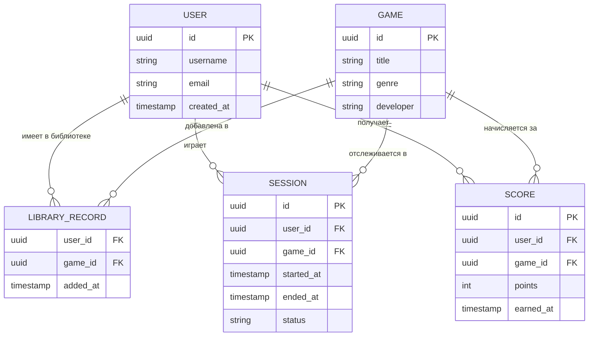

1. Бизнес-контекст
Мы строим игровую платформу-трекер, что-то типа облегченного аналога Steam. Это система, где пользователи могут смотреть каталог игр, добавлять их в свою библиотеку, а платформа будет трекать их игровые сессии, наигранные часы и заработанные очки. На основе этого будут строиться глобальные рейтинги игроков.

2. Основные сценарии
Управление аккаунтом: регистрация и авторизация.
Работа с библиотекой: просмотр каталога и добавление игры к себе.
Трекинг активности: система фиксирует начало и конец сессии, считает время.
Начисление очков: за достижения во время игры пользователю падают очки.
Статистика и рейтинги: можно посмотреть часы конкретного игрока и общий лидерборд по игре.

3. Основные сущности
User (Пользователь): ID, никнейм, email, дата регистрации.
Game (Игра): ID, название, описание, жанр, разработчик.
LibraryRecord (Запись библиотеки): связка юзера и игры (ID пользователя, ID игры, дата добавления).
Session (Игровая сессия): ID сессии, ID юзера, ID игры, время начала и конца, статус (активна или завершена).
Score (Очки): ID юзера, ID игры, количество очков, дата получения.

4. Связи
Один юзер может иметь много записей в библиотеке (1:M).
Одна игра может быть в библиотеках многих юзеров (1:M).
Один юзер может создать много сессий (1:M).
Каждая сессия привязана только к одной игре (1:1).

5. Бизнес-правила
Нельзя запустить игру, которой нет в библиотеке.
У юзера не может быть двух активных сессий одновременно.
Время конца сессии должно быть строго больше времени начала.
Очки начисляются только за те игры, которые есть в системе.

7. ER-диаграмма базы данных
